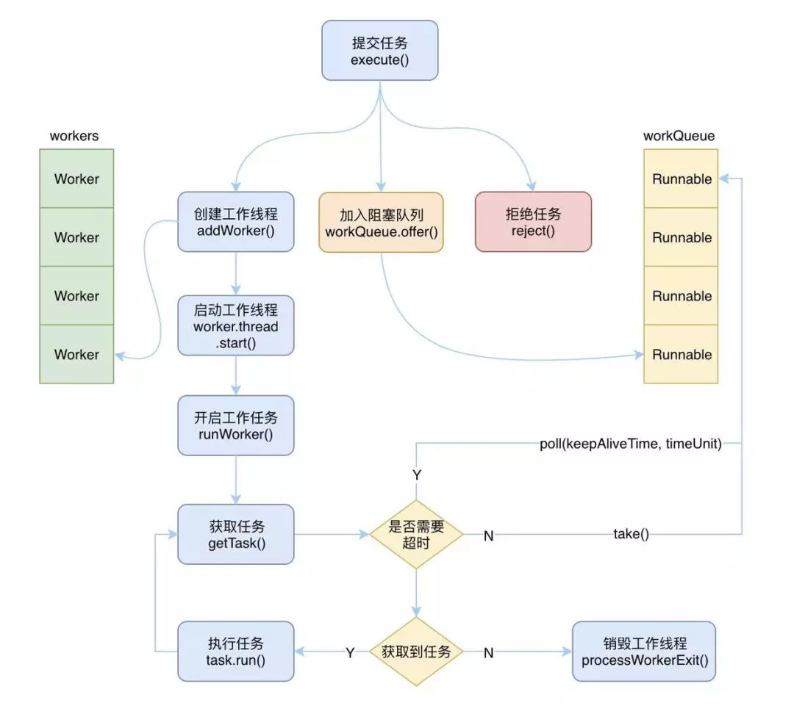

# 多线程  

## 一、线程池  

- 接口： **Executor**、**ExecutorService**  
- 实现类： **ThreadPoolExecutor**  

```  java
public ThreadPoolExecutor(int corePoolSize,
                          int maximumPoolSize,
                          long keepAliveTime,
                          TimeUnit unit,
                          BlockingQueue<Runnable> workQueue,
                          ThreadFactory threadFactory,
                          RejectedExecutionHandler handler)
```

- **ThreadPoolExecutor线程池执行流程**  

    

- **线程池工作流程**  

    

- 线程池状态  
  - **running**  运行状态，改状态下线程可以接受新的任务，也可以处理阻塞队列中的任务  
  - **shutdown**  待关闭状态，不再接受新的任务，继续处理阻塞队列中的任务，当阻塞队列中的任务为空，并且工作线程数为0时，进入tidying状态  
  - **stop**  停止状态，不接受新任务，也不处理阻塞队列中的任务，并且会尝试结束执行中的任务，当工作线程数为0时，进入tidying状态  
  - **tidying**  整理状态，此时任务都已经执行完毕，并且没有工作线程，执行terminated方法进入terminated状态  
  - **terminated**  终止状态，此时线程完全终止，并完成资源的释放  

- Executors静态工厂创建几种常用线程池   
  1. **newFixedThreadPool**  

  ```  java
  public static ExecutorService newFixedThreadPool(int nThreads) {
    return new ThreadPoolExecutor(nThreads, nThreads,
                                  0L, TimeUnit.MILLISECONDS,
                                  new LinkedBlockingQueue<Runnable>());
  }
  ```
  ```java
  /**创建一个指定工作线程数的线程池，其中参数 corePoolSize 和 maximumPoolSize 相等，阻塞队列基于LinkedBlockingQueue,具有线程池提高程序效率和节省创建线程时所耗的开销的优点。但是在线程池空闲时，即线程池中没有可运行任务时，它也不会释放工作线程，还会占用一定的系统资源; **/
  public static ExecutorService newFixedThreadPool(int nThreads, ThreadFactory threadFactory) {
    return new ThreadPoolExecutor(nThreads, nThreads,
                                  0L, TimeUnit.MILLISECONDS,
                                  new LinkedBlockingQueue<Runnable>(),
                                  threadFactory);
  }
  ```

  2. **newSingleThreadExecutor**  
  ```  java
  public static ExecutorService newSingleThreadExecutor() {
    return new FinalizableDelegatedExecutorService
        (new ThreadPoolExecutor(1, 1,
                                0L, TimeUnit.MILLISECONDS,
                                new LinkedBlockingQueue<Runnable>()));
  }
  ```
  ```  java
  /**初始化的线程池中只有一个线程，如果该线程异常结束，会重新创建一个新的线程继续执行任务，唯一的线程可以保证所提交任务的顺序执行，内部使用LinkedBlockingQueue作为阻塞队列**/
   public static ExecutorService newSingleThreadExecutor(ThreadFactory threadFactory) {
    return new FinalizableDelegatedExecutorService
        (new ThreadPoolExecutor(1, 1,
                                0L, TimeUnit.MILLISECONDS,
                                new LinkedBlockingQueue<Runnable>(),
                                threadFactory));
   }
  ```
  
  3. **newCachedThreadPool**  
  ```  java
  public static ExecutorService newCachedThreadPool() {
    return new ThreadPoolExecutor(0, Integer.MAX_VALUE,
                                  60L, TimeUnit.SECONDS,
                                  new SynchronousQueue<Runnable>());
  }
  ```
  ```  java
  /**创建一个可缓存工作线程的线程池，默认存活时间60秒，线程池的线程数可达到Integer.MAX_VALUE，即2147483647，内部使用SynchronousQueue作为阻塞队列;在没有任务执行时，当线程的空闲时间超过keepAliveTime，则工作线程将会终止，当提交新任务时，如果没有空闲线程，则创建新线程执行任务，会导致一定的系统开销  **/
  public static ExecutorService newCachedThreadPool(ThreadFactory threadFactory) {
  return new ThreadPoolExecutor(0, Integer.MAX_VALUE,
  							  60L, TimeUnit.SECONDS,
  							  new SynchronousQueue<Runnable>(),
  							  threadFactory);
   }
  ```
  
  4. **newScheduledThreadPool**  
  ```  java
  public static ScheduledExecutorService newScheduledThreadPool(int corePoolSize) {
    return new ScheduledThreadPoolExecutor(corePoolSize);
  }
  ```
  ```java
  /**初始化的线程池可以在指定的时间内周期性的执行所提交的任务，在实际的业务场景中可以使用该线程池定期的同步数据**/
  public static ScheduledExecutorService newScheduledThreadPool(
        int corePoolSize, ThreadFactory threadFactory) {
    return new ScheduledThreadPoolExecutor(corePoolSize, threadFactory);
  }
  ```

## 二、代码示例

```  java
//创建实现Callable接口的任务类
public class MaterialUploadTask implements Callable<MaterialUploadResult> {
    private MaterialUploadBean bean;
    private ClService clService;
    private TYwgyDzjzWs ws;
    @Override
    public MaterialUploadResult call() throws Exception {
    	//具体业务处理逻辑
        return clService.uploadCl(bean, ws);
    }
}

//创建执行类
public class ClExecutor {
	private ExecutorService streamMaterialUploadTask；
	@PostConstruct
	public void init(){
		//初始化一个线程池
		streamMaterialUploadTask = new ThreadPoolExecutor(5, 20 , 60L, TimeUnit.SECONDS, new LinkedBlockingDeque<Runnable>(100000), 
		new ThreadFactoryBuilder().setNameFormat("materialUploadExecutor-pool-%d").build(), new ThreadPoolExecutor.AbortPolicy());
	}
	
	public Future<MaterialUploadResult> asynUploadExecute(StreamMaterialUploadTask task) {
		return streamMaterialUploadTask.submit(task);
	}
}

//具体使用
private ClExecutor clExecutor;
Future<MaterialUploadResult> uploadResultFuture = clExecutor.asynUploadExecute(
                    new MaterialUploadTask(bean, clService, ws));
```


