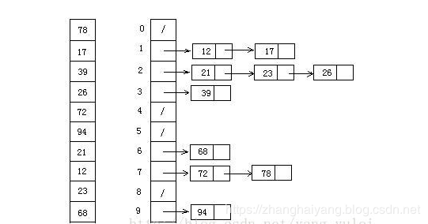

# 排序算法  

## 1.冒泡排序  

- 算法描述：  

依次比较相邻的两个元素，按既定的顺序，如果顺序错误就交换

- 动图：


- Java代码示例：

```java
public class BubbleSort {
    public static void main(String[] args) {
        int[] arr = {3, 44, 38, 5, 47, 15, 36, 26, 27, 2, 46, 4, 19, 50, 48};
        bubbleSort(arr);
        System.out.println(Arrays.toString(arr));
    }

    private static void bubbleSort(int[] arr) {
        for (int i = 0; i < arr.length - 1; i++) {
            for (int j = i + 1; j < arr.length - i - 1; j++) {
                if (arr[j + 1] < arr[j]) {
                    int temp = arr[j];
                    arr[j] = arr[j + 1];
                    arr[j + 1] = temp;
                }
            }
        }
    }

}
```

## 2.选择排序  

- 算法描述：  

从待排序的数据元素中选出最大或最小的元素，存放在序列的起始位置，再从剩余的待排序列中选出最大或最小的元素，放到已排序列的末尾；以此类推，直至待排序列的数据元素个数为0

- 动图：


- Java代码示例：

```java
private static void selectSort(int[] arr) {
	if (arr.length == 0) {
		return;
	}

	for (int i = 0; i <= arr.length - 1; i++) {

		int index = i;
		for (int j = i + 1; j <= arr.length - 1; j++) {
			if (arr[index] > arr[j]) {
				index = j;
			}
		}

		int temp = arr[i];
		arr[i] = arr[index];
		arr[index] = temp;
	}
}


```


## 3.插入排序  

- 算法描述：  

构建有序序列，对于未排序列，在已排序列中从后向前扫描，找到相应位置并插入

- 动图：


- Java代码示例：

```java
public static void insertSort(int arr[]) {
	if (arr.length == 0) {
		return;
	}

	for (int i = 0; i < arr.length - 1; i++) {
		//待插入的数
		int temp = arr[i + 1];

		while (i >= 0 && temp < arr[i]) {
			arr[i + 1] = arr[i];
			i--;
		}
		arr[i + 1] = temp;

	}
}
```

## 4.希尔排序  

- 算法描述：  

针对插入排序，最坏情况场景的的优化

缩小增量，将原始序列进行分组：{n/2,(n/2)/2,...1},称之为`增量序列`，对若干子序列进行直接插入排序；

- 动图：


- 静态图


- Java代码示例：

```java
public static void shellSort(int[] arr) {
	//缩小增量，进行分组
	for (int gap = arr.length / 2; gap > 0; gap /= 2) {
		//对分组内的元素进行插入排序
		for (int i = gap; i < arr.length; i++) {
			int temp = arr[i];
			int preIndex = i - gap;
			while (preIndex >= 0 && arr[preIndex] > temp) {
				arr[preIndex + gap] = arr[preIndex];
				preIndex -= gap;
			}
			arr[preIndex + gap] = temp;
		}
	}
}
```


## 5.快速排序  

- 算法描述：
  
> 分治法，将一个序列分为两个序列  
	- 从序列中挑选一个元素，作为基准
	- 比基准元素小的放到基准元素前面，比基准元素大的放到基准元素后面，基准处于中间位置
	- 递归地进行上一步操作


- 动图：


- Java代码示例：

```java

```


## 6.归并排序  

- 算法描述：  

- 动图：


- Java代码示例：

```java

```

## 7.计数排序  

- 算法描述：  

- 动图：


- Java代码示例：

```java

```

## 8.桶排序  

- 算法描述：  

- 图片演示：



- Java代码示例：

```java

```

## 9.堆排序  

- 算法描述：  

- 动图：


- Java代码示例：

```java

```

## 10.基数排序  

- 算法描述：  

- 动图：


- Java代码示例：

```java

```